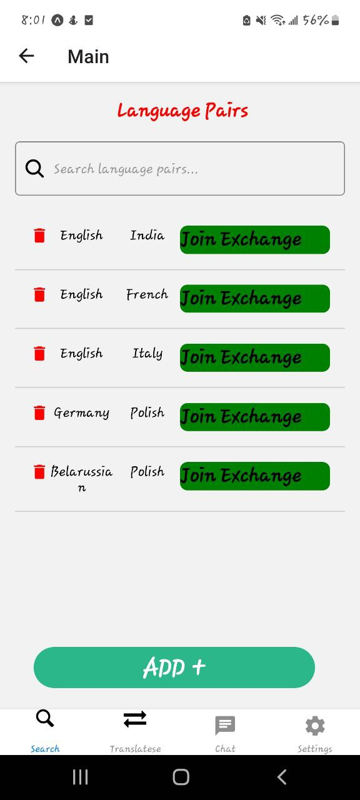

# LanTransapp

## 👉 Sample screenshots taken from the App

## Technologies ⚛️
 - `React Native`
 - `Firebase`
 - `Typescript`
 - `expo`

 ## Usage

1. Run the app: `npm start`
2. Use Expo to test the app on your local machine or deploy it to your preferred mobile device.

## Author 📝
- Biruk Birhanu(bbirukse@gmail.com)

---

Thank you
